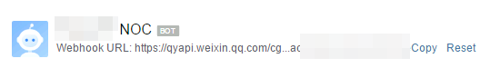
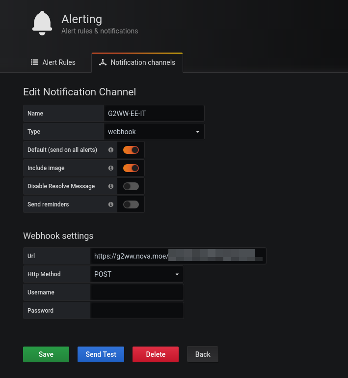
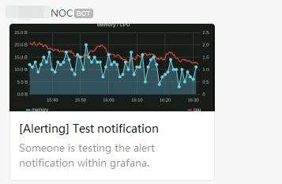

# G2WW (Grafana 2 Wechat Work)
> Proxy Grafana Webhook alert to WeChat Work.

Grafana doesn't support push alert to WeChat Work(企業微信) by it's design, this is a small adapter for supporting this.


## Build g2ww

```
go build *.go -o g2ww
```

You can use docker if you don't want to build it yourself. Just download the [docker-compose.yml](https://raw.githubusercontent.com/n0vad3v/g2ww/master/docker-compose.yml) file, and `docker-compose up -d`

```
wget https://raw.githubusercontent.com/n0vad3v/g2ww/master/docker-compose.yml
docker-compose up -d
```

Then g2ww will listen on `localhost:2408`, quite simple isn't it?

## Run g2ww

Run `g2ww` on server, it will listen on `http://127.0.0.1:2408` by default, keep it running in background (`systemd` or `screen`?).


## Let Nginx to proxy it

Like this:

```
server {
        listen 80;
        server_name g2ww.nova.moe;

        location / {
            proxy_pass http://127.0.0.1:2408;
        }
}
```

## Create a Wechat Work Bot

Create a Wechat Work Bot and get the webhook address.



For instance, the webhook address is `https://qyapi.weixin.qq.com/cgi-bin/webhook/send?key=e28dde4c-1998-0002-0018-114514114514`.

## Configure Grafana

In the configuration above, we need to specify the address like this:

`https://g2ww.nova.moe/e28dde4c-1998-0002-0018-114514114514`



## Demo



Quite simple, isn't it?